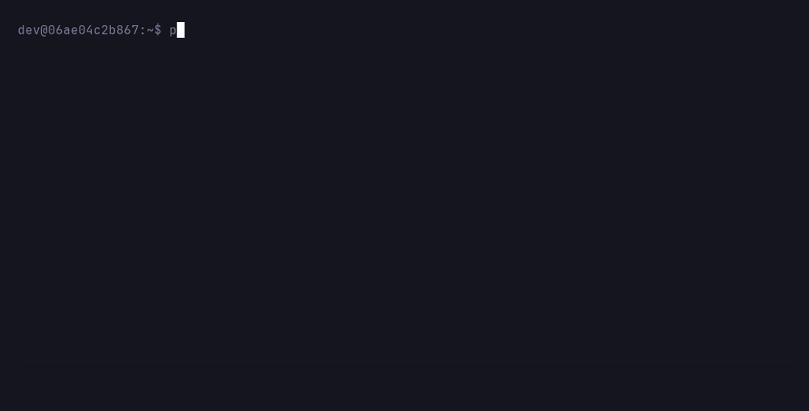

# peek

[](https://github.com/skinleak/peek/actions/workflows/ci.yml)
[](https://pkg.go.dev/github.com/skinleak/peek)
[](LICENSE)

**See what's listening on your ports, and free them up.**

`peek` is a fast, zero-config CLI that replaces the
`lsof -i :3000 | grep LISTEN | awk '{print $2}' | xargs kill` incantation everyone keeps googling.

<p align="center">
  
</p>

## Features

- **One command, no flags to remember:** `peek` lists everything that's listening.
- **Answers "who's on port 3000?"** with the process, PID, bind address, working directory and uptime. For interpreters it also names the script, so you see `node (vite)` or `python3 (manage.py)` instead of a column of `node`s.
- **Interactive mode:** `peek -i` opens a live view that refreshes every second. Pick a row and press `x` to stop it.
- **Frees a port safely:** `peek kill 3000` asks first, sends SIGTERM and checks that the process actually exited. Plain `peek kill` lets you pick from a list.
- **Knows about Docker:** ports published by containers show the container name, and `peek kill` stops the container instead of breaking Docker's proxy.
- **Shows exposure at a glance:** binds reachable from other machines (`0.0.0.0`, `::`) are highlighted differently from local-only ones (`127.0.0.1`, `::1`).
- **Scriptable:** `--json` output and meaningful exit codes.
- **Tiny and instant:** a single static binary for Linux and macOS, with no config files and no runtime dependencies.

## Install

**Homebrew** (macOS and Linux):

```sh
brew install skinleak/tap/peek
```

**Install script** (macOS and Linux). It downloads the latest release, verifies its checksum and installs to `/usr/local/bin`, or `~/.local/bin` if that isn't writable:

```sh
curl -fsSL https://raw.githubusercontent.com/skinleak/peek/main/install.sh | sh
```

**Go** (1.26 or newer):

```sh
go install github.com/skinleak/peek/cmd/peek@latest
```

Or download a binary from the [releases page](https://github.com/skinleak/peek/releases).

## Usage

```sh
peek                    # everything listening
peek 3000               # who's on port 3000
peek 3000-3999          # a port range
peek 22 8000-8100       # several ports and ranges

peek kill 3000          # stop the process on port 3000 (asks for confirmation)
peek kill 3000 --yes    # don't ask
peek kill 3000 --force  # send SIGKILL instead of SIGTERM
peek kill               # pick processes to stop from a list
peek kill 3000-3999     # pick among the processes in a range

peek -i                 # live view: browse ports and stop processes
peek -i 3000-3999       # live view of a port range

peek --json             # machine-readable output
peek --version
peek --help
```

Flags can go before or after the ports, so `peek kill 3000 -f -y` works too.

### Reading the output

| Column  | Meaning                                                                                                                                          |
| ------- | ------------------------------------------------------------------------------------------------------------------------------------------------ |
| PORT    | The listening TCP port                                                                                                                           |
| PROCESS | Process name, plus the script or module for interpreters like `node`, `python` or `java` (`-` if it belongs to another user and you aren't root) |
| PID     | Process ID                                                                                                                                       |
| ADDRESS | Bind addresses: amber when exposed to the network, green when local-only                                                                         |
| CWD     | The process's working directory, with your home shown as `~`                                                                                     |
| UPTIME  | How long the process has been running                                                                                                            |

A process listening on the same port on several addresses (such as `127.0.0.1` and `::1`) gets one row listing all of them. A socket shared by several processes (for example a pre-forking web server) shows one row per process.

Colors adapt to light and dark terminals. They're switched off automatically when output isn't a terminal or when [`NO_COLOR`](https://no-color.org) is set.

### Interactive mode

`peek -i` (or `--interactive`) opens a full-screen view that rescans every second. The title counts the listening ports and how many are exposed to the network. Ports that just opened are marked with `+`, and ports that just closed stay on screen dimmed for a few seconds. The line under the table shows the selected process's full command line.

Press `enter` for a detail panel with everything peek knows about the selected port: its bind addresses, full command line, working directory, start time, user and how many clients are connected right now. From the list or the panel, `o` opens the port in your browser and `c` copies its URL.

| Key                    | Action                                                                                                                                 |
| ---------------------- | -------------------------------------------------------------------------------------------------------------------------------------- |
| `↑` `↓` / `j` `k`      | Move the selection                                                                                                                     |
| `PgUp` `PgDn`, `g` `G` | Jump by a page, or to the top or bottom                                                                                                |
| `enter`                | Show or hide the detail panel for the selected port                                                                                    |
| `o`                    | Open the port in your browser (`http://localhost:<port>`)                                                                              |
| `c`                    | Copy its URL to the clipboard                                                                                                          |
| `x`                    | Stop the selected process (SIGTERM) or Docker container, after you confirm                                                             |
| `X`                    | Force kill it (SIGKILL, or `docker kill`) after you confirm                                                                            |
| `/`                    | Filter by port, process, command, directory, address or user, with matches highlighted; `enter` applies the filter and `esc` clears it |
| `s`                    | Change the sort order: port, process name, or uptime (newest first)                                                                    |
| `S`                    | Reverse the sort order                                                                                                                 |
| `r`                    | Rescan now                                                                                                                             |
| `?`                    | Show all keys                                                                                                                          |
| `esc`                  | Go back from the detail panel, or clear the filter                                                                                     |
| `q` / `Ctrl+C`         | Quit                                                                                                                                   |

In narrow terminals peek leaves out the least important details first, such as the CWD and UPTIME columns, instead of wrapping lines.

You can also use the mouse: click a row to select it, click it again to open its details, and scroll with the wheel. Most terminals still let you select text by holding `Shift`.

Copying uses `pbcopy` on macOS and `wl-copy`, `xclip` or `xsel` on Linux. Without them, for example over SSH, peek asks the terminal to copy instead (OSC 52), which most modern terminals support.

Stopping works the same way as `peek kill`: peek waits for the process to exit and reports an error if it didn't.

### Picking what to stop

`peek kill` without a port, or with ports that several processes listen on, shows a list right in your terminal:

```
Which processes should peek stop?
> next
› ○ 3000, 3001  node (next)  48213  2h14m  ~/code/webapp
 ↑↓ move   space select   ctrl+a all   enter stop it   esc cancel
```

Type to filter, `space` to select several (`ctrl+a` selects everything shown), and `enter` to stop the selection, or the highlighted process if nothing is selected. `esc` clears the filter, then cancels. Each process or container appears once, with all of its ports. `--force` works as usual, and `--yes` with ports skips the list and stops everything that matches.

Without a terminal, for example in a script, nothing changes: `peek kill 3000-3999` stops everything in the range after confirming (or right away with `--yes`), and `peek kill` without ports is an error.

### Docker containers

When a port is published by a Docker container, `peek` shows the container name instead of `docker-proxy`:

```
 PORT  PROCESS             PID  ADDRESS  CWD  UPTIME
 5432  webapp-db (docker)    -  0.0.0.0  -    -
```

`peek kill 5432` then stops the container through the Docker API (`docker stop`, or `docker kill` with `--force`) rather than killing the proxy process, which would free the port but leave Docker in a broken state.

This needs access to the Docker socket (on Linux, being in the `docker` group). It works with `/var/run/docker.sock`, Docker Desktop, rootless Docker and `DOCKER_HOST=unix://...`. If Docker isn't available, `peek` works as usual.

### Seeing other users' processes

Operating systems only let you inspect your own processes without root. Run `sudo peek` to see everything.

- **Linux:** ports owned by other users still show up, but with the process and PID as `-`.
- **macOS:** ports owned by other users don't show up at all, the same as `lsof`.

### JSON

```sh
$ peek 3000 --json
[
  {
    "port": 3000,
    "protocol": "tcp",
    "address": "127.0.0.1",
    "pid": 48213,
    "process": "node",
    "command": ["node", "server.js"],
    "cwd": "/home/dev/code/webapp",
    "start_time": "2026-10-07T13:01:42+02:00",
    "user": "dev",
    "connections": 2
  }
]
```

`connections` is the number of established connections to the port that peek can see, which on macOS means connections held by your own processes unless you run it with sudo. JSON has one entry per socket, so a process listening on both `127.0.0.1` and `::1` appears twice. Fields that couldn't be read (such as `pid` for another user's process) are left out. Ports published by Docker containers also have `container` and `container_id`. When nothing matches, the output is `[]`.

### Exit codes

| Code | Meaning                                                                                   |
| ---- | ----------------------------------------------------------------------------------------- |
| 0    | Success                                                                                   |
| 1    | Nothing is listening on the requested port(s), the kill was declined, or something failed |
| 2    | Usage error, such as an invalid port or unknown flag                                      |

This makes `peek` handy in scripts:

```sh
peek 5432 >/dev/null || echo "start the database first"
```

## Platform support

| OS      | Status                              |
| ------- | ----------------------------------- |
| Linux   | Supported (amd64, arm64)            |
| macOS   | Supported (Apple Silicon and Intel) |
| Windows | Planned                             |

## How it works

`peek` doesn't shell out to `lsof`, `ss` or `netstat`; it asks the kernel directly.

- **Linux:** it reads `/proc/net/tcp` and `/proc/net/tcp6` for sockets in the LISTEN state, maps each socket's inode to processes by scanning `/proc/<pid>/fd`, and reads each process's name, command line, working directory and start time from `/proc/<pid>`.
- **macOS:** it uses libproc (`proc_pidinfo` and `proc_pidfdinfo`), the same interface `lsof` uses, and the `kern.procargs2` sysctl for command lines. It calls libproc without cgo, so the binary stays static.

## Roadmap

- Windows support
- UDP sockets

## Contributing

Contributions are welcome! See [CONTRIBUTING.md](CONTRIBUTING.md) to get started.

## License

[MIT](LICENSE)
