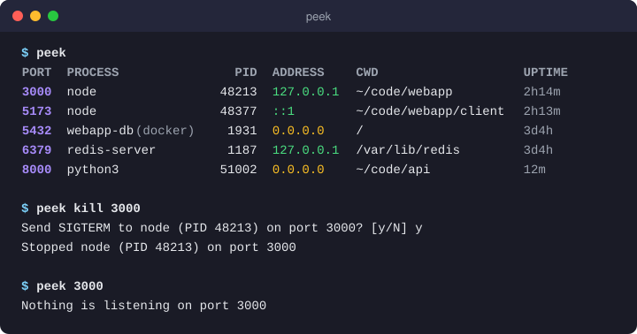

# peek

[](https://github.com/aaron03EM/peek/actions/workflows/ci.yml)
[](https://pkg.go.dev/github.com/aaron03EM/peek)
[](LICENSE)

**See what's listening on your ports, and free them up.**

`peek` is a fast, zero-config CLI that replaces the
`lsof -i :3000 | grep LISTEN | awk '{print $2}' | xargs kill` incantation everyone keeps googling.

<p align="center">
  
</p>

## Features

- **One command, no flags to remember:** `peek` lists everything that's listening.
- **Answers "who's on port 3000?"** with the process, PID, bind address, working directory and uptime.
- **Frees a port safely:** `peek kill 3000` asks first, sends SIGTERM and checks that the process actually exited.
- **Shows exposure at a glance:** binds reachable from other machines (`0.0.0.0`, `::`) are highlighted differently from local-only ones (`127.0.0.1`, `::1`).
- **Scriptable:** `--json` output and meaningful exit codes.
- **Tiny and instant:** a single static binary with no config files and no runtime dependencies.

## Install

With Go 1.26 or newer:

```sh
go install github.com/aaron03EM/peek/cmd/peek@latest
```

This puts `peek` in `$(go env GOPATH)/bin`. Make sure that directory is on your `PATH`.

Or build from source:

```sh
git clone https://github.com/aaron03EM/peek.git
cd peek
go build -o peek ./cmd/peek
```

## Usage

```sh
peek                    # everything listening
peek 3000               # who's on port 3000
peek 3000-3999          # a port range
peek 22 8000-8100       # several ports and ranges

peek kill 3000          # stop the process on port 3000 (asks for confirmation)
peek kill 3000 --yes    # don't ask
peek kill 3000 --force  # send SIGKILL instead of SIGTERM

peek --json             # machine-readable output
peek --help
```

Flags can go before or after the ports, so `peek kill 3000 -f -y` works too.

### Reading the output

| Column  | Meaning |
|---------|---------|
| PORT    | The listening TCP port |
| PROCESS | Process name (`-` if it belongs to another user and you aren't root) |
| PID     | Process ID |
| ADDRESS | Bind address: amber when exposed to the network, green when local-only |
| CWD     | The process's working directory, with your home shown as `~` |
| UPTIME  | How long the process has been running |

A socket shared by several processes (for example a pre-forking web server) shows one row per process.

Colors adapt to light and dark terminals. They're switched off automatically when output isn't a terminal or when [`NO_COLOR`](https://no-color.org) is set.

### Seeing other users' processes

Without root, Linux only lets you inspect your own processes. Ports owned by other users still show up, but with the process and PID as `-`. Run `sudo peek` to see everything.

### JSON

```sh
$ peek 3000 --json
[
  {
    "port": 3000,
    "protocol": "tcp",
    "address": "127.0.0.1",
    "pid": 48213,
    "process": "node",
    "cwd": "/home/dev/code/webapp",
    "start_time": "2026-10-07T13:01:42+02:00",
    "user": "dev"
  }
]
```

Fields that couldn't be read (such as `pid` for another user's process) are left out. When nothing matches, the output is `[]`.

### Exit codes

| Code | Meaning |
|------|---------|
| 0    | Success |
| 1    | Nothing is listening on the requested port(s), the kill was declined, or something failed |
| 2    | Usage error, such as an invalid port or unknown flag |

This makes `peek` handy in scripts:

```sh
peek 5432 >/dev/null || echo "start the database first"
```

## Platform support

| OS      | Status |
|---------|--------|
| Linux   | Supported (reads `/proc`) |
| macOS   | Planned |
| Windows | Planned |

## How it works

On Linux, `peek` reads `/proc/net/tcp` and `/proc/net/tcp6` for sockets in the LISTEN state. It then maps each socket's inode to processes by scanning `/proc/<pid>/fd`, and reads each process's name, working directory and start time from `/proc/<pid>`. No external tools like `lsof` or `ss` are needed.

## Roadmap

- `peek --watch`: a live-refreshing view
- macOS and Windows support
- Prebuilt release binaries

## Contributing

Contributions are welcome! See [CONTRIBUTING.md](CONTRIBUTING.md) to get started.

## License

[MIT](LICENSE)
